# 低仿抖音短视频
------
临近毕业，选了《微视频社交网站的开发》这个题作为毕业设计，然后就照着[抖音](https://www.douyin.com/)打算用自己自学的知识（前端方向）来实现一遍。该项目基本使用JavaScript（ES6/7）开发，混入了Python写的爬虫来爬取[梨视频](https://www.pearvideo.com/)的短视频来丰满自己的数据库。

__注：本项目仅供学习交流使用，切勿用于商业用途，如有侵犯第三方版权问题及时联系我__

## 前端技术栈
 - Axios
 - Vue2
 - Vuex
 - Vue Router
 - Vue CLI 3
 - Vue-socket.io
 - Stylus
## 后端技术栈
 - koa2
 - sequelize
 - ioredis
 - socket.io

## 项目运行
__注意：由于涉及大量的 ES6/7 等新属性，node 需要 6.0 以上版本__

```
git clone https://github.com/asdwsx1234/vue-douyin.git 

cd vue-douyin

npm install

启动redis数据库和mysql数据库

redis数据库配置文件为./server/redis.js
mysql数据库配置文件为./server/config.js

node ./server/init-db.js (初始化数据库生成表结构) -- 空表
或者将./server/utils/backup.sql还原到你自己的数据库下

node ./server/app.js （启动服务器）

npm run serve （前端项目）


```
前后端都在一个项目里（感觉不是很合理），所以必须先启动后端相关的服务器。

## 说明
>  如果对您有帮助，您可以点右上角 "Star" 支持一下 谢谢！ :grin:

## 效果演示
[查看demo请戳这里](http://www.zhoubaba.club)（请用chrome手机模式预览）

__移动端扫描下方二维码__


## 目标功能
 - [x] 登录、注册
 - [x] 密码找回
 - [x] 修改个人资料
 - [x] 个人信息浏览（已发布、点赞的视频）
 - [x] 上传头像
 - [x] 发送邮件验证
 - [x] 视频浏览
 - [x] 关注与粉丝
 - [x] 视频点赞、评论点赞
 - [x] 视频评论、回复评论
 - [x] 评论@用户
 - [x] 关注动态浏览
 - [x] 好友（互相关注）间私信
 - [x] 发布动态
 - [x] 搜索视频，用户（根据视频描述，根据昵称或id）
 - [x] 私信、被关注、被评论、被@、被点赞、关注人发布动态的消息提醒
 - [ ] 分享
 - [ ] [后台管理](https://github.com/asdwsx1234/vue-douyin-admin)
 
## 总结
>  不定时补充，就当写毕业论文了 :grin:

1、123121

## 部分截图
### 登录页


### 注册页
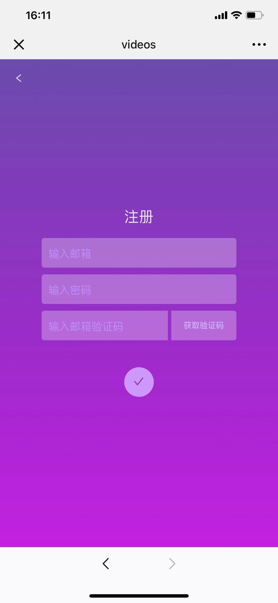

### 取回密码页
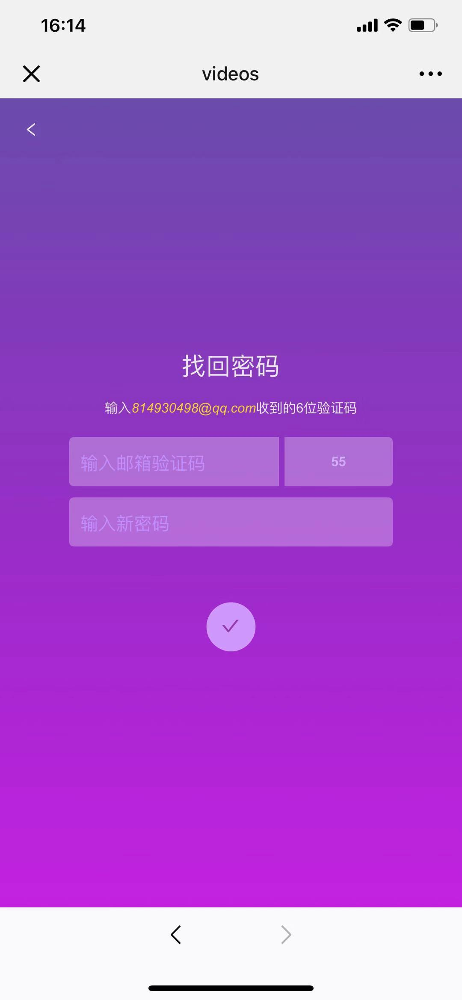

### 主页
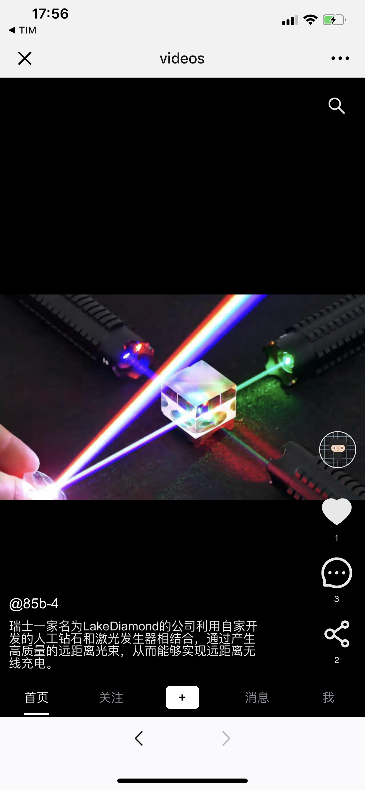

### 动态页
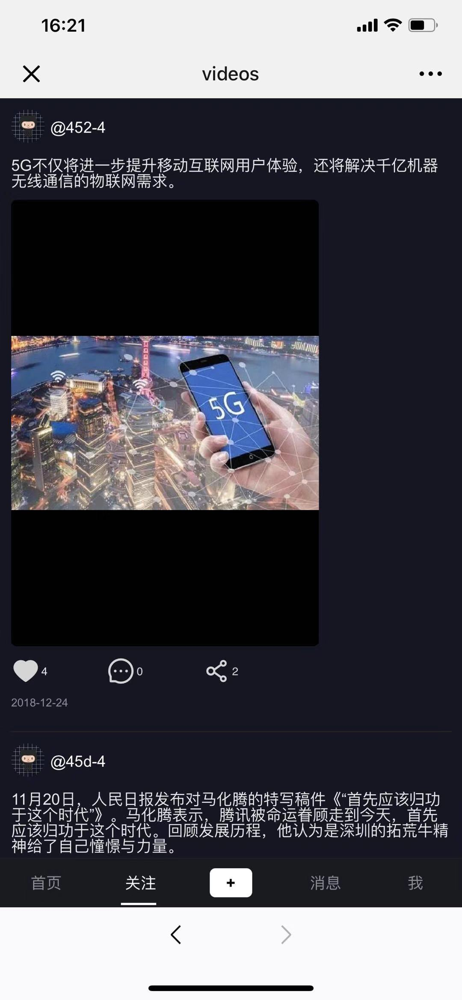
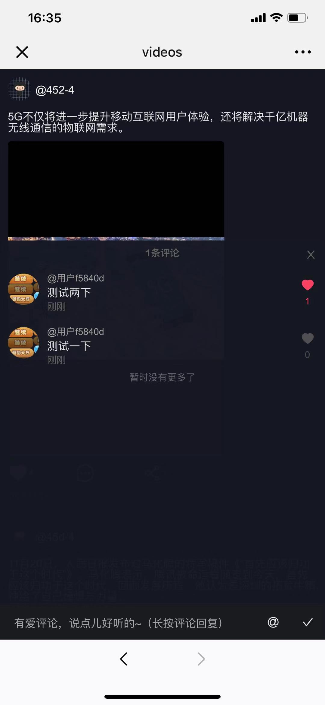

### 消息页
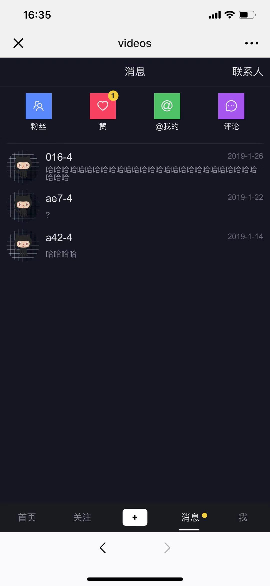

### 粉丝消息页


### 赞消息页
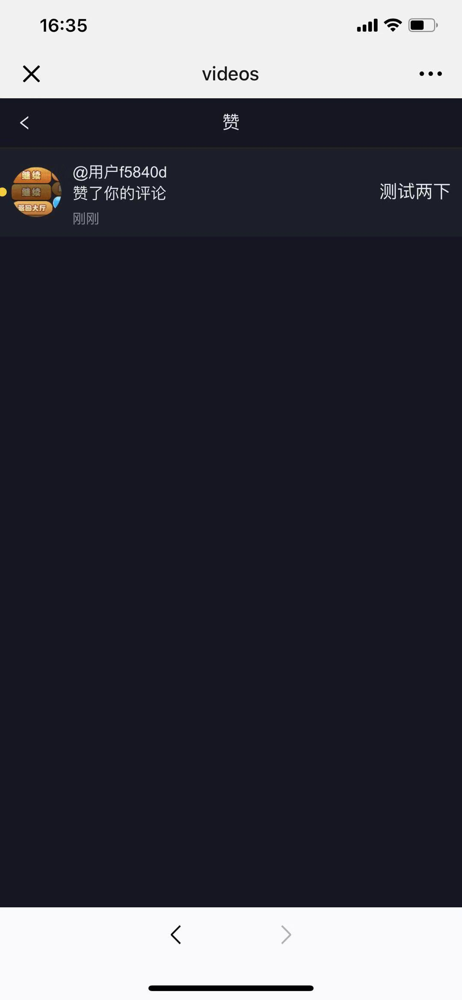

### @我的消息页


### 评论消息页
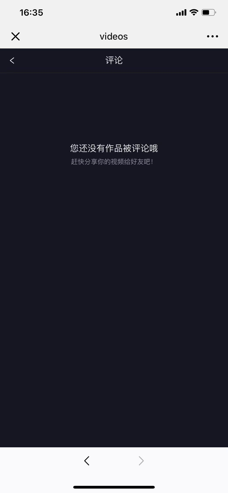


### 个人资料页
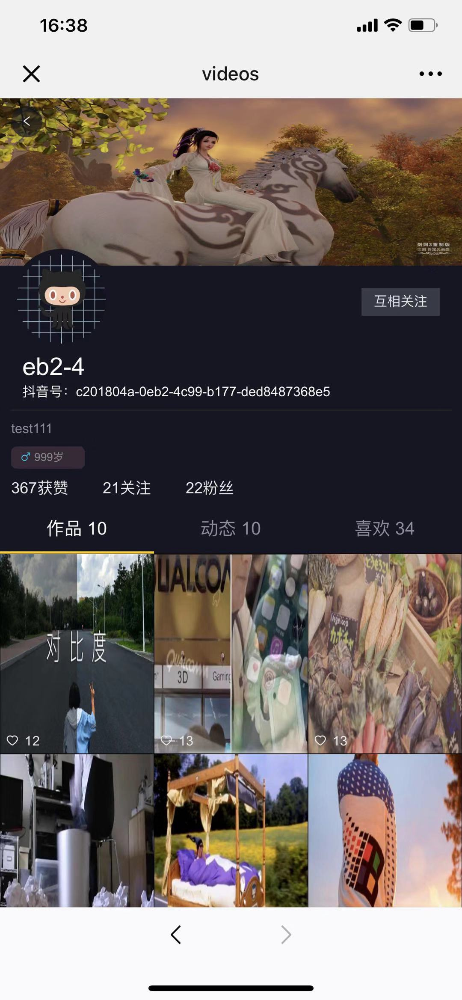
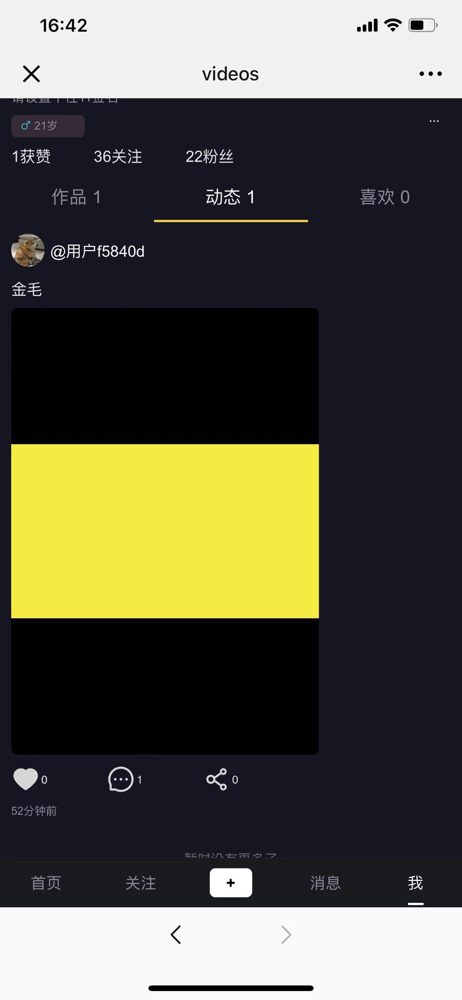
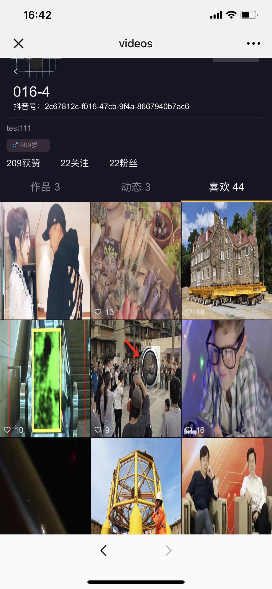

### 修改个人资料页
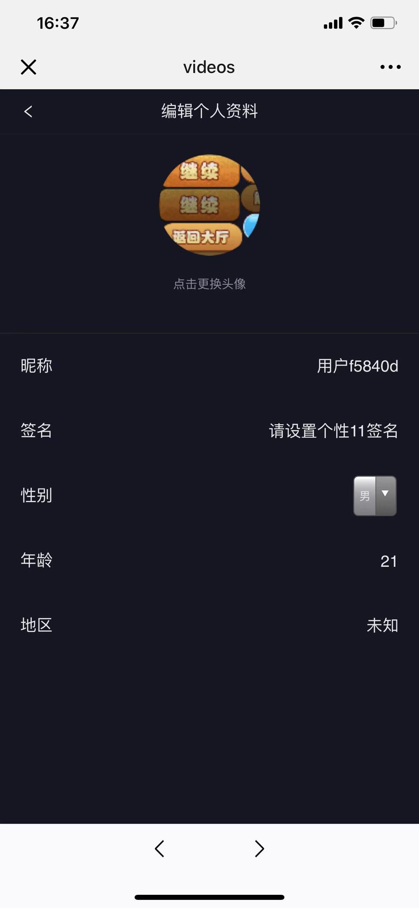

### 搜索视频页


### 搜索用户页
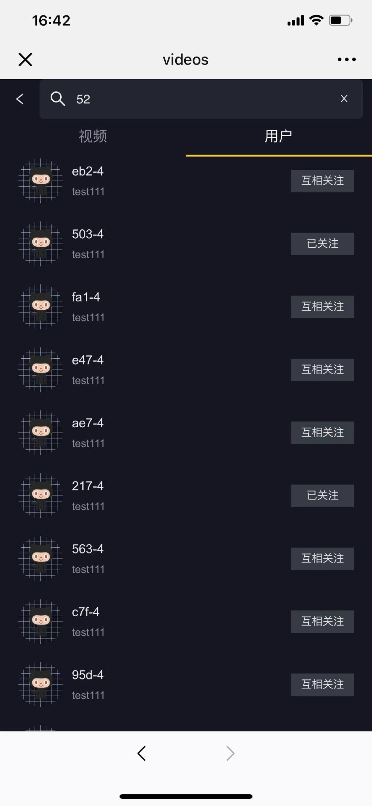

### 发布动态页
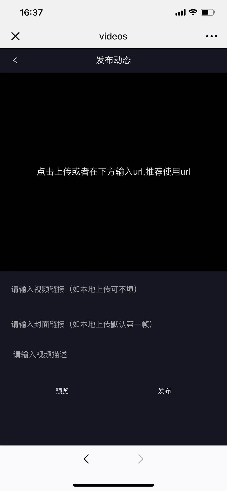

### 粉丝列表页
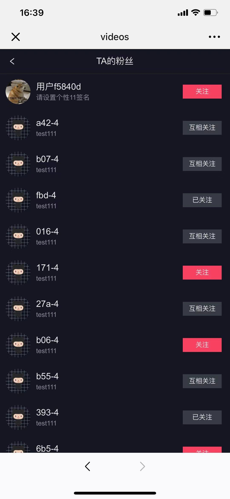

### 关注列表页
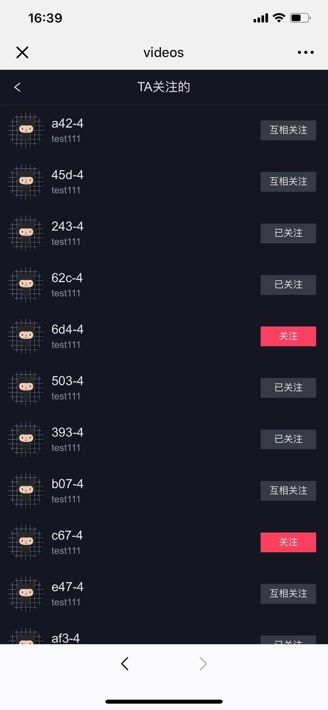

### 联系人页
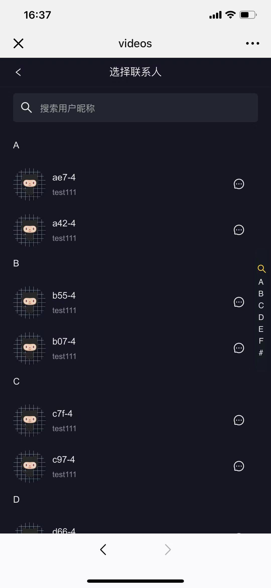

### 私聊页
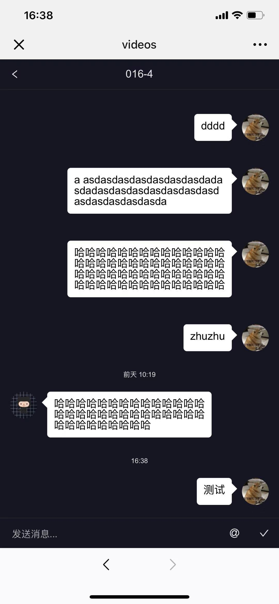

## 目录结构
```
.
├── public
├── server(服务器在这里)
│   ├── controllers(各个类别的controller)
│   ├── models(sequelize模型)
│   ├── static
│   │   ├── assets
│   │   │   ├── avatar(静态资源头像)
│   │   │   ├── css
│   │   │   ├── fonts
│   │   │   ├── img
│   │   │   ├── js
│   │   │   ├── videoCover(静态资源视频封面)
│   │   │   └── videoPath(静态资源视频)
│   └── utils(服务器util)
├── src（前端项目在这里）
│   ├── base(基础组件)
│   ├── common
│   │   ├── fonts(iconfont)
│   │   ├── js(util/config)
│   │   └── stylus
│   ├── components(逻辑组件)
│   ├── store(vuex)
│   └── views(页面)

```

## License
[MIT](./LICENSE)
